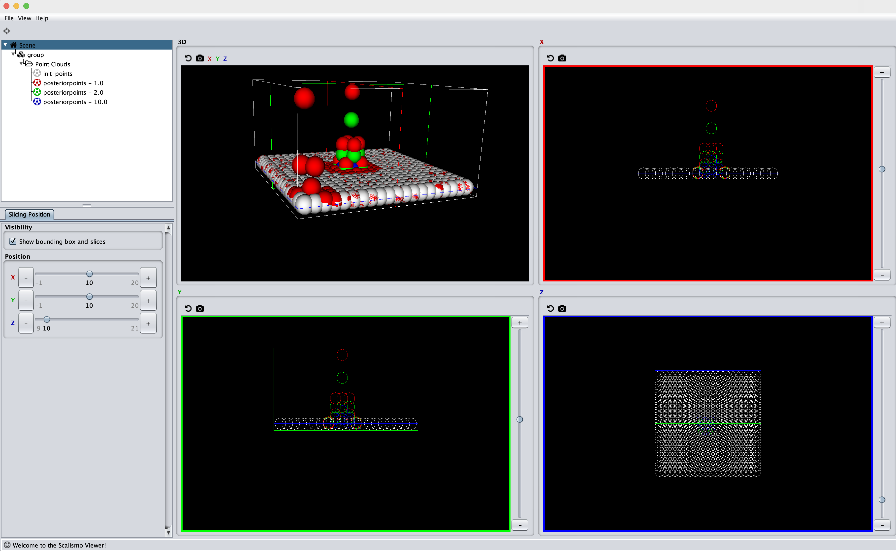
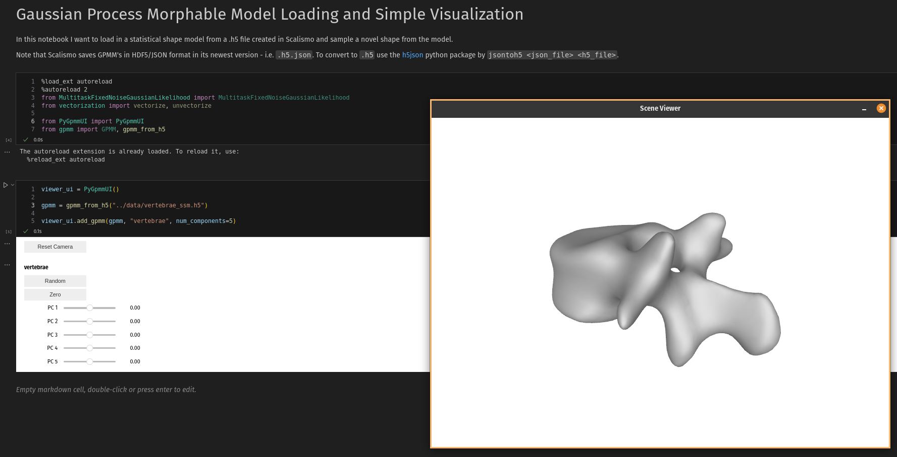

# Gaussian Process Regression for 3D point Deformations
This repo explores how to do gaussian process regression (GPR) in 3D where the observations are 3D deformations. 

This concept originates from how it is done in [Scalismo]([https://www.example.com](https://scalismo.org/))

The repo explores how the concept can be moved from Scala to Python to be better integrated with a Machine Learning pipelines. This is first done using Sklearn's GaussianProcessRegressor and, thereafter the Gpytorch library such that it can eventually utilize GPU acceleration. 

## Scala
Install [scala-cli](https://scala-cli.virtuslab.org/)
CD into the scala directory. 
Execute `scala-cli gpr.scala`
This will open Scalismo-UI and show the following:

In the image we see that the output of 3 different posterior computations each conditioned on 2 deformations. One deformation in the corner with a noise set to 1.0 and another point in the center with a different uncertainty over the 3 different runs: 1.0, 2.0 and 5.0. 

## Python
Install [miniconda](https://docs.anaconda.com/miniconda/)

CD into the python directory.

Set up the python environment:
```
conda env create --file packages.yml
```
Start the jupyter server
```
conda activate mynotebooks
jupyter notebook
```

## GPMM Visualization in Jupyter notebook
To visualize and interact with a GPMM in a jupyter notebook, we use `Pyrender` and `ipywidgets`.

The notebook `python/gpmm_visualizer` shows a simple example:



The Vertebrea example can be computed from this repo: [how-to-shape-model](https://github.com/madsendennis/how-to-shape-model).
